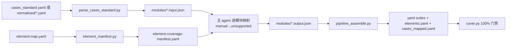

# AT-Case Generator — 从规范用例产物生成 AT-SPI 套件

## What this skill does

把 **at-case-authoring**（模式 B）已经规范化的用例与元素映射表，直接生成
可执行的 AT-SPI `*.suite.yaml` 套件。产物与 **at-suite-generator** 一致
（`tests/at/yaml/` + `elements.yaml` + `cases_mapped.yaml`），可直接被
`youqu at run` 消费。

- **输入**：`cases_standard.yaml`（AI 规范化全量）或 `normalized/*.yaml`
  （按模块规范化）+ `element-map.yaml`
- **输出**：`tests/at/yaml/<module>/<module>.suite.yaml`、`tests/at/yaml/elements.yaml`、
  `tests/at/cases_mapped.yaml`、`tests/at/element-coverage-manifest.yaml`、
  `tests/at/coverage-report.yaml`、`tests/at/unreachable.yaml`（如有豁免）

**不扫描源码、不解析 xlsx、不切分（规范技能已切）、不用子 agent。**

## Why this skill exists（与 at-suite-generator 的差异）

at-suite-generator 从 xlsx 出发：静态扫描（libclang）→ 切分 → 子 agent 映射。
本技能不这么做，因为：

1. **白名单来源不同**：at-suite-generator 用静态扫描的 `pre_scan_ok.yaml` 名作
   selector 白名单；但封装型源码（`Utils::setAccessibility()` 间接调用、`AC_*`
   宏、`QString("%1_button").arg(...)` 动态拼接）libclang 解析不出运行时名，
   扫描拿到的是中间名（实测 element-map 与扫描仅 14/57 交集）。element-map 的
   `id_name` 是**运行时真实名**（setAccessibleName / acTextDefine 宏 / QAction
   文本），是 selector 白名单的唯一权威。
2. **用例已规范化**：at-case-authoring 模式 B 已产出 `cases_standard.yaml`（含
   raw_* 供校对）与 `normalized/*.yaml`（按模块，含 manual/reason），无需再次
   转换或切分。
3. **主 agent 直接映射**：不用子 agent 池（协调开销 > 收益）。逐模块读
   input.json + element-map，输出 output.json。

## Default workflow

1. **准备**（Stage 1）— `parse_cases_standard.py`：规范产物 → `modules/*.input.json`
   （整模块一片，token 保护不做语义重切）。
2. **清单**（Stage 1）— `element_manifest.py`：element-map →
   `element-coverage-manifest.yaml`（白名单 + 瞬态菜单 + 待补名）。
3. **映射**（Stage 2）— **主 agent** 逐模块，用
   `templates/at-case-mapping-prompt-template.md` 把 input.json →
   `modules/<slug>_<seq>.output.json`。
4. **组装**（Stage 3）— `pipeline_assemble.py`：output.json → suite YAML +
   elements.yaml + cases_mapped.yaml（与 at-suite-generator 同源脚本，格式一致）。
5. **门禁**（Stage 3）— `cover.py`：100% 覆盖门禁（分母 = element-map 非 TBD
   非菜单 id_name）。
6. **验证**（Stage 4）— Gate 5/4 + 运行时 smoke（有 DISPLAY 时）。

## Boundary

- **Owns**：从规范用例产物生成 AT-SPI 套件、覆盖门禁。
- **Does NOT own**：xlsx → 规范 YAML（`at-case-authoring` 模式 B）；源码扫描 /
  覆盖率统计（`at-spi-coverage`）；setAccessibleName 补全（`at-spi-completion`）。
- 输入产物必须已由 `at-case-authoring` 规范化（`manual` / `reason` / 模块划分
  齐备），本技能不校审规范合规性。

## 核心规则（why）

- **白名单 = element-map 运行时名**。selector 的定位键必须来自清单的
  `elements` 键，按 manifest 的 `locator` 判定：`locator: accessible_id`
  （元素有 `object_name`，Qt6 编码进 accessible_id 点分路径后缀，executor
  后缀匹配 + 智能分派自动菜单导航）→ `selector.accessible_id`；`locator: name`
  （仅 setAccessibleName）→ `selector.name`。**有 object_name 优先用
  accessible_id**（objectName 唯一稳定）。禁止虚构、禁止用 ui_name 中文、
  禁止用静态扫描名。
- **菜单项自动归类，不填 menu_type**：executor 运行时按菜单项父 popup 的
  accessible_id 段模式自动分类（实测 deepin-editor，Qt6/DTK6）：
  - popup 含 `DropdownMenu` 段（如 `EditorApplication.DropdownMenu`）→
    DDropdownMenu，点共享段 PToolButton 触发（WindowsAction 实测通过）
  - popup 含 `Menu`/`Menu_` 段（如 `Menu_2`）→ 主菜单，标题栏
    OptionMenu 按钮真实点击触发 + 键盘导航（**禁 TAB**，DTK 不支持；
    Settings/NewWindow 实测通过）
  - popup 含 `QMenu` 段 + DropdownMenu/Menu 段 → 嵌套子菜单（编码列表
    UTF-8、主题浅色等），先展开父项再键盘导航（父链自动收集）
  - popup 含 `QMenu` 段（无 DropdownMenu/Menu）→ 右键菜单；**关闭态树
    可能无节点**（CloseTab 实测不存在）或节点无 objectName 编码（大写/
    小写 aid 后缀是裸 QAction），需用例提供 `context_trigger`（右键触发点
- **element-map 不填 menu_type 字段**（真实 deepin-editor element-map 无此
  字段）。菜单项持久/瞬态判定看**有无 `object_name`**：有 object_name 编码
  的项（DDropdownMenu 的 WindowsAction、主菜单 Settings）→ 持久，进分母，
  用 `selector.accessible_id` 引用（引擎自动开菜单 + 键盘导航）；无
  object_name 编码或关闭态无节点的右键菜单项 → 用例用 `dtk_context_menu` +
  触发点 + `items` 文本。
- **TBD/空 id_name 与 object_name 不进分母**：运行时无法按名定位，清单
  `unresolved` 段单列供开发补名；人工豁免走 `unreachable.yaml`（cover.py
  唯一豁免输入）。**`unresolved` ≠ `unreachable`**，二者不可混淆。
- **manual 用例 → `status: unsupported` + `reason`**：直接消费 at-case-authoring
  的 `manual: true` / `reason`，不再让映射 agent 自行判断。unsupported suite
  **不产生可执行 case**（assemble 跳过）——仅保留决策痕迹。
- **主 agent 直接映射**：不用子 agent、不跑 `gen_schedule.py`。模块 ≥1 都顺序
  映射，每模块输出独立 output.json，`meta` 原样沿用 input.json。
- **100% 门禁是硬要求**：每个白名单元素必须被至少一个持久 `selector.name` 或
  `selector.accessible_id` 引用。缺口 → 补漏循环（主 agent 聚焦补充）→
  100% 或 `unreachable.yaml` 人工豁免。

## Gotchas

- **`slices/` vs `normalized/`**：at-case-authoring 的 `slices/` 是机械切分（
  manual 全 false，缺 AI 规范化标记）；`normalized/*.yaml` 是 AI 规范化后按模块
  产物（含 manual/reason）。**用 normalized/ 或 cases_standard.yaml**，不要用
  slices/（会丢不可自动化标记）。
- **token 预算**：规范产物按模块切分，个别模块可能较大（实测 AI全量 189 条约
  12.4k token，在上下文内）。若某模块超预算（>20k），用
  `parse_cases_standard.py --budget` 对该模块按 token 重切（只切不聚类）。
- **`elements.yaml` ≠ 白名单**：`elements.yaml` 是组装输出（含清单补充的完整
  白名单 + 用例实际引用）；门禁分母读 element-map，不是 elements.yaml。
- **重复 `id_name`**：element-map 常对同一 id_name 列多个 ui_name（如保存按钮/
  保存截图按钮），清单按 id_name 去重。
- **菜单例外**：不要在 `selector.name` 里放瞬态菜单项名（如 menuUndo /
  microphoneAction），它们是瞬态的；`element_action` 会定位失败。用
  `dtk_main_menu` + `items`（文本）。**运行时自动分类**：
  - popup 段含 `DropdownMenu` / `Menu_` → `selector.accessible_id` +
    `element_action`（引擎智能分派自动菜单导航，deepin-editor 实测
    WindowsAction→Windows、Settings/NewWindow 通过；智能分派找不到唯一
    触发按钮时回退 `dtk_dropdown_menu` + selector + items=objectName 后缀）
  - 右键 QMenu（关闭态无节点或无 objectName）→ 用 `dtk_context_menu` +
    右键触发点 selector + items
  - 嵌套子菜单（DropdownMenu.QAction.QMenu / Menu_2.QAction.QMenu）→
    引擎自动收集父链（Unicode→UTF-8、主题→浅色），无需手写路径
- **`element_action` 的 `do` 白名单**：仅 `click` / `right_click` / `double_click` /
  `focus` / `point`；`do: clear`/`do: set` 运行时直接报 `Unknown element action`。
  清空输入框用键盘（`Ctrl+A` + `Delete`），赋值用 `element_set_value`。
- **assemble 去重**：`pipeline_assemble.py` 按 action 类型序列去重同模块 suite。
  同型 suite 会被合并——映射时给不同 suite 用不同操作，避免误合并。
- **全 manual 模块产出为空**：某模块全部用例 unsupported 时不产生 suite 文件，
  但该模块元素仍需其它模块覆盖或列入 unreachable.yaml，否则门禁 FAIL。

## Scripts

| Script | Purpose | Run when |
|--------|---------|----------|
| `scripts/parse_cases_standard.py` | 规范产物 → `modules/*.input.json` | Stage 1 |
| `scripts/element_manifest.py` | element-map → 白名单 manifest | Stage 1 |
| `scripts/pipeline_assemble.py` | output.json → suite YAML + elements.yaml | Stage 3 |
| `scripts/cover.py` | element-map 100% 覆盖门禁 | Stage 3 |

`pipeline_assemble.py` 与 at-suite-generator 同源（复制），保证产物格式一致；
`VALID_ACTIONS` / `ASSERT_ACTIONS` 与运行时 HANDLERS 同步。

## Banned

| Action | Reason |
|--------|--------|
| 跑源码静态扫描 / 用扫描名作白名单 | 封装型源码解析不出运行时名；element-map 是权威 |
| 解析 xlsx / 重复切分 / 用 slices/ | at-case-authoring 已产出 cases_standard + normalized |
| 子 agent 映射 | 用户决策：主 agent 直接映射，效率优先 |
| `selector.name` 用 ui_name 中文 / 虚构名 / unresolved 名 | 运行失败 |
| 瞬态菜单项进 `selector.name` | QMenu 瞬态，运行失败；用 dtk_main_menu |
| DDropdownMenu 菜单项用 `dtk_main_menu` | 应为 accessible_id 智能分派（见核心规则） |
| 跳过 `cover.py` 门禁 | 100% 是硬要求 |
| 把 `manual` 用例生成成可运行 suite | 规范技能已标记不可自动化，应 unsupported |
| 把 `unresolved`（TBD）抄进 unreachable.yaml | 二者语义不同：unresolved 待补名，unreachable 已命名不可达 |

## Dependencies

| Dependency | When | Install |
|-----------|------|---------|
| Python >= 3.10 | always | system |
| PyYAML | always | `pip install pyyaml` |
| `youqu` CLI | run/verify | `pip install youqu-ai` |
| `at-case-authoring` skill | input products | sibling skill（模式 B 产物） |

## Errors & fallbacks

| Failure | Behavior |
|---------|----------|
| 无 `cases_standard.yaml` / `normalized/` | 提示先跑 at-case-authoring 模式 B |
| element-map 无元素 | 停止，检查 element-map |
| 某模块映射失败 | 重试一次；仍失败跳过该模块，报告标注 |
| 覆盖门禁 FAIL | 补漏循环（主 agent 聚焦补充）→ 100% 或豁免 |
| 运行时验证失败 | 标记 suite `status: unstable` |
| 无 DISPLAY | 跳过运行时验证 |

## Verification checklist

- [ ] `modules/*.input.json` 完整性校验通过（316/316 例：无丢失无篡改）
- [ ] `element-coverage-manifest.yaml` 有 `elements` / `transient_items` / `unresolved`
- [ ] 每个模块一个 output.json，`meta` 沿用 input.json；manual 用例标
      `unsupported` + `reason`
- [ ] `pipeline_assemble.py` 0 error；`elements.yaml` 含白名单全部元素
- [ ] `cover.py` 100%（selector.name 或 selector.accessible_id 引用皆可；豁免均在
      `unreachable.yaml`，未把 `unresolved` 混入）
- [ ] DDropdownMenu 菜单项用 `selector.accessible_id` 引用（未误用 dtk_main_menu）
- [ ] 产物在 `tests/at/`，格式与 at-suite-generator 一致
