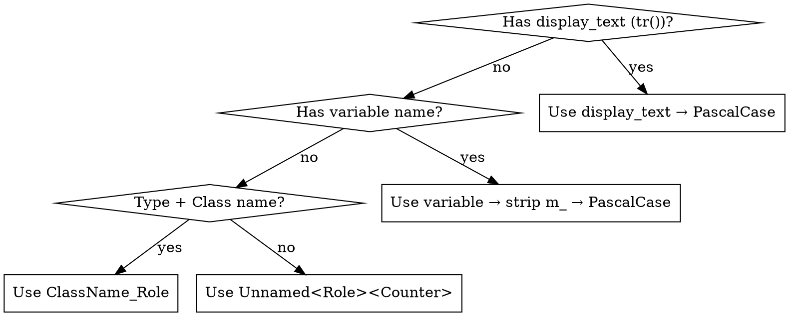

# AT-SPI API Completion

## Overview

Scans C++ Qt/DTK source for missing `setAccessibleName()` / `setObjectName()` calls on interactive widget instances, generates PascalCase names, and guides the LLM to insert the missing calls.

**Transient element coverage:** Runtime AT-SPI dumps (dogtail/youqu at dump) cannot see transient menus — context menus, main menus, dropdowns only exist while visible. This skill's `menu_extractor.py` statically recovers them from source (see [Transient Menus](#transient-menus--naming)).

## When to Use

- Scan output shows widget AT-SPI name coverage < 80%
- Accessibility tools / YouQu test framework cannot locate UI controls by name
- "no such node" or "name not found" errors for interactive elements

**When NOT to use:**
- Layouts, labels, progress bars, frames — decorative elements don't need names
- Third-party code you don't own

## Quick Reference

| Phase | Command | Output |
|-------|---------|--------|
| **Scan** | `scan_gaps.py --src <dir> --build <dir>` | `pre_scan_gaps.yaml` |
| **Generate** | `naming.py pre_scan_gaps.yaml [-o map.txt]` | Name suggestions (stdout/file) |
| **Apply** | LLM inserts calls in constructor | Modified `.cpp` files |
| **Validate** | `quality_gate.py --src <dir> --baseline <yaml>` | `quality_report.json` |
| **Transient** | `menu_extractor.py --src <dir> --compile-commands <cc> --ts-dir <td> --ts-lang zh_CN` | `menu_structure.yaml` |

## Name Generation Priority



Full naming rules: [naming_conventions.md](naming_conventions.md) (PascalCase, English, 64-char max, alphanumeric + underscore only).

## Workflow

### Phase 1 — Scan

```bash
# Primary: AST-level scan (libclang)
# NOTE: Large projects may take 5+ minutes. Use `timeout 360` if needed.
python3 scripts/scan_gaps.py --src /path/to/src --build /path/to/build --output tests/at/spi/

# Optional: Qt Designer .ui supplement
python3 -c "from ui_parser import scan_ui_files, merge_ui_gaps; import yaml; ..."
```

### Phase 2 — Generate Names

```bash
# Basic — stdout
python3 scripts/naming.py tests/at/spi/pre_scan_gaps.yaml

# For parallel apply, save mapping to a file for all agents to reference:
python3 scripts/naming.py tests/at/spi/pre_scan_gaps.yaml -o tests/at/spi/name_map.txt
```

Priority: display text (`tr()`) → variable name (strip `m_`) → `ClassName_Role` → `Unnamed<Role><Counter>`.

> **⚠️ For parallel execution**: Always run naming.py first and save the name_map file. Every sub-agent must read this file to use the canonical names (including `_2`, `_3` suffix disambiguation), not generate names independently.

### Phase 3 — Apply Fixes (LLM)

Per gap (batch ≤ 20), open `source_file` at `line`, find the `new` expression, add both calls **immediately after**:

```cpp
// Pointer member — after new expression
m_nameLineEdit = new DLineEdit(this);
m_nameLineEdit->setObjectName("NameLineEdit");
m_nameLineEdit->setAccessibleName("NameLineEdit");
```

```cpp
// Value member / Ui_* pattern — after setupUi()
ui->setupUi(this);
ui->nameEdit->setObjectName("NameEdit");
ui->nameEdit->setAccessibleName("NameEdit");
```

```cpp
// QAction — after creation (new or addAction)
// NOTE: QAction inherits QObject, NOT QWidget. It only has setObjectName().
// setAccessibleName() does NOT exist on QAction → compile error.
m_newAction = new QAction(tr("New Window"), this);
m_newAction->setObjectName("NewWindowAction");
```

```cpp
// QShortcut — after new QShortcut(...)
// NOTE: QShortcut inherits QObject, NOT QWidget. Only setObjectName() is available.
m_endProcKP = new QShortcut(QKeySequence(Qt::ALT + Qt::Key_E), this);
m_endProcKP->setObjectName("EndProcKp");
```

> ⚠️ **Only QWidget subclasses have `setAccessibleName()`.** QAction, QShortcut, and other pure-QObject types compile with `setObjectName()` only — adding `setAccessibleName()` to them is a **compile error**. Verify the widget type in `pre_scan_gaps.yaml` (`type` field) before inserting. Common non-widget types: `QAction *`, `QShortcut *`, `QMenu *` (QMenu IS a widget, OK), `DMenu *` (OK).

**Both `setObjectName()` AND `setAccessibleName()` are required for QWidget subclasses** (QAction/QShortcut get `setObjectName()` only). Re-scan every 2-3 batches to check for regressions.

### 👥 Parallel Apply Strategy

When gaps span many files (>20), use parallel sub-agents for efficiency:

1. **Generate authoritative map** — `python3 naming.py gaps.yaml -o map.txt` (this preserves `_2`, `_3` suffix order)
2. **Split by file** — assign disjoint file sets to sub-agents (never split gaps within one file)
3. **Sub-agents read the map** — each agent must read `map.txt` and use exact names from it
4. **Re-scan after all complete** — run `scan_gaps.py` to check for collisions
5. **Fix residual collisions** — if any duplicate names remain despite the map, use `ClassName_Role` (e.g., `CompactCpuMonitor_DetailButton`, `CpuMonitor_DetailButton`)

```bash
# Step 1: Generate canonical name file
python3 scripts/naming.py tests/at/spi/pre_scan_gaps.yaml -o tests/at/spi/name_map.txt

# Step 2: Sub-agents read and apply from name_map.txt

# Step 3: Validate
python3 scripts/quality_gate.py --src ... --build ... --baseline tests/at/spi/pre_scan_gaps.yaml --threshold 80
```

### Phase 4 — Validate

```bash
python3 scripts/quality_gate.py --src /path/to/src --build /path/to/build \
  --baseline tests/at/spi/pre_scan_gaps.yaml --threshold 80 --output tests/at/spi/
```

### Phase 5 — Transient Elements: Extract + Translate

Runtime AT-SPI dumps cannot see transient elements — context menus, main menus,
dropdowns, and any `tr()`-labeled widgets only exist while visible or have no
static variable reference. `menu_extractor.py` recovers them statically:

```bash
python3 scripts/menu_extractor.py \
  --src /path/to/src \
  --compile-commands /path/to/build/compile_commands.json \
  --ts-dir /path/to/translations \     # Qt .ts files
  --ts-lang zh_CN \                     # test env language (必做)
  --output tests/at/spi/
```

Output: `menu_structure.yaml` — every menu item with `text_en` (from source `tr()`/`translate()`) and `text_zh` (from `.ts` file, matched by file+line).

> **`text_zh` is mandatory for all `tr()`-sourced elements**, not just menus.
> The `.ts` file provides the Chinese translation that test cases match against
> in a Chinese test environment. If a user-visible element has a `tr()` call
> in its display text, its Chinese translation MUST be resolved via `.ts`.
> Elements without a `.ts` entry (brand names, DTK-provided translations) keep
> EN-only — this is correct behaviour for untranslated strings.

Extraction coverage (verified on deepin-terminal):

| Element | Source pattern | Extracted? |
|---------|---------------|-----------|
| Context menu items | `m_menu->addAction(tr("Copy"), ...)` | ✅ EN + ZH |
| Submenus | `QMenu *search = new QMenu(); m_menu->addMenu(search)` | ✅ parent link |
| Main menu items | `addAction(qApp->translate("Ctx", THEME_CONST))` | ✅ EN (const resolved) |
| Menu separators | `m_menu->addSeparator()` | ✅ type=separator |
| Brand names (Bing/Baidu) | `search->addAction("Bing")` | ✅ EN only (no .ts entry — correct) |
| DTK-provided translations | `qApp->translate("TitleBarMenu", ...)` | ✅ EN only (.ts lacks them — correct) |
| `addAction(existingActionVar)` | `group->addAction(lightThemeAction)` | ⏭ skipped (not a new item) |

### Phase 6 — Merge: Produce `expected_names.yaml`

Merge persistent results (Phase 1-4) with transient results (Phase 5) into a
single regression baseline. **The output MUST be written to the TARGET APP
project** (e.g. `deepin-terminal/tests/at/spi/expected_names.yaml`), not to the
skill directory:

```bash
python3 scripts/merge_names.py \
  --input tests/at/spi \
  --output /path/to/target/app/tests/at/spi/expected_names.yaml
```

**Clean up intermediate artifacts:** Once `expected_names.yaml` is produced, remove
the per-phase output files (they are NOT committed):
```bash
rm -f tests/at/spi/pre_scan_*.yaml tests/at/spi/pre_*.json \
      tests/at/spi/menu_structure.yaml tests/at/spi/name_map.txt
```

### Phase 7 — Commit (REQUIRED in the target project)

Commit `expected_names.yaml` **together with the applied source changes** to the
**target app repository** (e.g. deepin-terminal, not this skill repo). This is
the regression baseline — future scans compare against it.
Complete the commit using the commit skill.

```bash
cd /path/to/target/app        # e.g. deepin-terminal
# Stage: modified .cpp/.h files + tests/at/spi/expected_names.yaml
git add -A
git commit
```

## Transient Elements — Naming

Widgets created via `addAction(tr(...))` lack variable names. Name them
hierarchically by their role in the UI tree:

| Menu type | Pattern | Example |
|-----------|---------|--------|
| Context menu | `ClassName_ContextMenu_ItemText` | `TermWidget_ContextMenu_Copy` |
| Main menu | `ClassName_MainMenu_ItemText` | `MainWindow_MainMenu_Settings` |
| Nested | `ClassName_MainMenu_SubMenu_ItemText` | `TermWidget_ContextMenu_Search_Bing` |
| Dedup | `_2`/`_3` suffix | `TermWidget_ContextMenu_Split_2` |

`ItemText` comes from `text_en` (PascalCase, e.g. `Copy` → `Copy`, `Open in file manager` → `OpenInFileManager`).

**Chinese matching:** Test cases are written in Chinese and run on a Chinese
environment. The runtime AT-SPI label of a transient element is the *translated*
text (`text_zh`, e.g. `复制`). **Always match against `text_zh` when writing
tests**, not the English `text_en`. If a transient element must be locatable by
objectName, it needs explicit `setObjectName()` in source (same as Phase 3).

**Coverage boundary for `tr()`:** All user-visible strings wrapped in `tr()`
have a corresponding `.ts` entry. The `menu_extractor.py` script resolves these
by `(file, line)` match. Strings without a `.ts` entry (brand names, DTK-provided
translations) keep EN-only — this is correct behaviour: they are either not
translated or managed by the framework.

## Common Mistakes

| Mistake | Consequence | Fix |
|---------|-------------|-----|
| Naming labels/frames/layouts | Noisy results, wasted review | Only interactive widgets need names |
| Missing `setAccessibleName()` | Tests may still fail | Always add both for QWidget subclasses |
| Inserting before `new` expression | SEGFAULT | Place calls after widget creation |
| Modifying `ui_*.h` files | Changes lost on next `uic` | Modify the consumer `.cpp` file |
| Chinese / special characters | AT-SPI resolution failure | English PascalCase only |
| Naming collisions | Two widgets share `objectName` | Use `_2`/`_3` suffix or `ClassName_Role` |
| **Ignoring `_2`/`_3` suffixes** | **Duplicate objectNames pass quality gate** | **Always check uniqueness in both `pre_scan_ok.yaml` AND `pre_scan_gaps.yaml`** |
| **Parallel sub-agents inventing names** | **Inconsistent naming, missed collisions** | **All sub-agents MUST read the naming map file** |

## Red Flags

- **"setObjectName is enough"** — for QWidget subclasses both calls required
- **"I modified the ui_*.h"** — it's auto-generated; edit the consuming `.cpp`
- **"Add names to everything"** — decorative elements don't need names
- **"I'll name it myself, naming.py is just a suggestion"** — always use naming.py output verbatim; it handles deduplication
- **"I'll worry about collisions later"** — fix them now; uniqueness is checked per-file, not per-widget-tree
- **"Menus are invisible to static scan"** — false: `menu_extractor.py` recovers them from `addAction(tr(...))` + `.ts` files
- **"translate() first arg is the label"** — first arg is the *context*; display text is the 2nd arg (may be a constexpr constant)
- **"Intermediate files are final output"** — `pre_scan_gaps.yaml` and `menu_structure.yaml` are intermediate; the **only** deliverable committed is `expected_names.yaml`

## Architecture

```
skills/at-spi-completion/
├── SKILL.md                    # This file
├── naming_conventions.md       # Full naming rules
└── scripts/
    ├── scan_gaps.py            # AST scanner (libclang)
    ├── menu_extractor.py       # Transient menu extractor (EN+ZH via .ts)
    ├── merge_names.py          # Merge → expected_names.yaml regression baseline
    ├── ui_parser.py            # Qt Designer .ui supplement
    ├── naming.py               # PascalCase name generator
    ├── quality_gate.py         # Re-scan + baseline compare
    └── generate_type_db.py     # Type DB from DTK/Qt headers
```

Run `python3 scripts/<name>.py --help` for per-script options.

## Quality Gate

| Check | Threshold | Description |
|-------|-----------|-------------|
| Coverage | ≥ 80% | Interactive widgets with AT-SPI names |
| New gaps | 0 | Fixes must not introduce gaps |
| Uniqueness | 0 | No duplicate `objectName` (checked on both `ok` and `gaps` files) |
| Conventions | 0 | PascalCase, English, no special chars |

> ⚠️ **Quality gate checks uniqueness on both `pre_scan_ok.yaml` AND `pre_scan_gaps.yaml`**. When coverage reaches 100% the gaps file is empty; without the ok-file check, duplicates would be invisible.

Dependencies: `sudo apt install python3-clang-18 libclang-18-dev && pip install pyyaml`