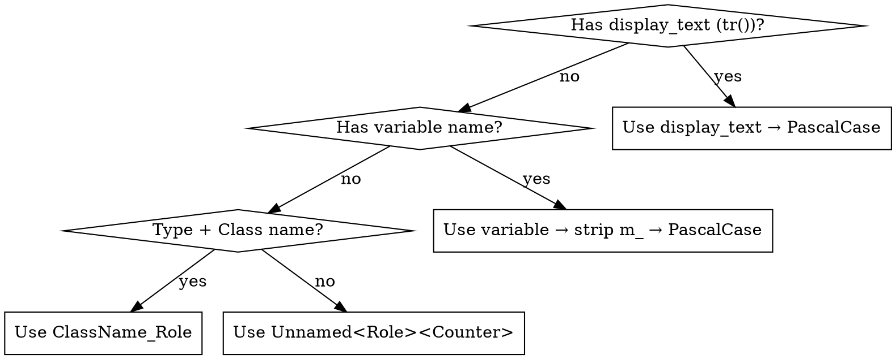

# AT-SPI API Completion

## Overview

Scans C++ Qt/DTK source for missing `setAccessibleName()` / `setObjectName()` calls on interactive widget instances, generates PascalCase names, and guides the LLM to insert the missing calls. **QML apps** are covered by a separate path: `scan_qml.py` scans `.qml` files for interactive elements missing the `Accessible.name` attached property and guides insertion of an `Accessible` block (tokenizer-based — no libclang/Qt runtime needed).

**Transient element coverage:** Runtime AT-SPI dumps (dogtail/youqu at dump) cannot see transient menus — context menus, main menus, dropdowns only exist while visible. This skill's `menu_extractor.py` statically recovers them from source (see [Transient Menus](#transient-menus--naming)).

## When to Use

- Scan output shows widget AT-SPI name coverage < 80%
- Accessibility tools / YouQu test framework cannot locate UI controls by name
- "no such node" or "name not found" errors for interactive elements
- QML app: interactive elements have no `Accessible.name` (scan_qml.py finds them)

**When NOT to use:**
- Layouts, labels, progress bars, frames — decorative elements don't need names
- Third-party code you don't own
- QML: `Text`, `Rectangle`, `Item`, layouts, `MouseArea` — decorative; skip

> **Core Principle: Only operable + assertion targets need AT-SPI names.**
> Container types (GroupBox, ScrollArea, Splitter, TabWidget, ToolBar, StatusBar, StackedWidget)
> are **decorative** — they hold other controls but tests never directly operate or assert on them.
> Only real interactive controls (buttons, inputs, sliders, menus, lists, tables, trees, tabs)
> need `setAccessibleName()` / `Accessible.name`. This spans both C++ and QML classification.
> The skill's scanners (`scan_gaps.py`, `scan_qml.py`) and quality gate enforce this:
> containers are never reported as gaps, coverage is calculated only over operable+assertion targets.
| **Scan (QML)** | `scan_qml.py --src <dir> --output tests/at/spi/` | `qml_gaps.yaml` + `qml_ok.yaml` |
| **Generate** | `naming.py pre_scan_gaps.yaml -o map.txt` | `name_map.txt` (with source_file:line info) |
| **Apply** | LLM inserts calls in constructor / `Accessible` block | Modified `.cpp` / `.qml` files |
| **Validate** | `quality_gate.py --src <dir> --build <dir> --baseline pre_scan_gaps.yaml --qml-baseline qml_gaps.yaml --expected-names expected_names.yaml` | `quality_report.json` + `quality_gate_scan/` |
| **Transient** | `menu_extractor.py --src <dir> --compile-commands <cc> --ts-dir <td> --ts-lang zh_CN` | `menu_structure.yaml` |
| **Merge** | `merge_names.py --input tests/at/spi --scan-dir tests/at/spi/quality_gate_scan --qml-dir tests/at/spi` | `expected_names.yaml` ✅ |

## Name Generation Priority



Full naming rules: [naming_conventions.md](naming_conventions.md) (PascalCase, English, 64-char max, alphanumeric + underscore only).

## Workflow

### Phase 1 — Scan

```bash
# Primary: AST-level scan (libclang)
# NOTE: Large projects may take 5+ minutes. Use `timeout 360` if needed.
# --src MUST be the repo root (contains src/ subdirectory) so that file paths
# in output match those in .ts translation files.
python3 scripts/scan_gaps.py --src /path/to/repo/root --build /path/to/build --output tests/at/spi/

# Optional: Qt Designer .ui supplement (experimental, see ui_parser.py --help)
python3 scripts/ui_parser_merge.sh tests/at/spi/
```

> ⚠️ `--src` must be the repository root, not `src/` subdirectory. The `.ts` translation files store paths relative to repo root (e.g. `src/views/w.cpp`); menu_extractor matches them by path suffix.

### Phase 2 — Generate Names

```bash
# Basic — stdout
python3 scripts/naming.py tests/at/spi/pre_scan_gaps.yaml

# For parallel apply, save mapping to a file for all agents to reference:
python3 scripts/naming.py tests/at/spi/pre_scan_gaps.yaml -o tests/at/spi/name_map.txt
```

Priority: display text (`tr()`) → variable name (strip `m_`) → `ClassName_Role` → `Unnamed<Role><Counter>`.

> **⚠️ For parallel execution**: Always run naming.py first and save the name_map file (`-o map.txt`). Every sub-agent must read this file and use the exact canonical name, **including `_2`/`_3` suffixes and the `source_file:line` info to disambiguate same-named variables in different files**. Parsing format:
> ```
> m_okButton     -> OkButton       # src/a.cpp:42
> m_okButton     -> OkButton_2     # src/b.cpp:15
> ```
> The `# {src}:{line}` suffix uniquely identifies which instance each name belongs to.

### Phase 3 — Apply Fixes (LLM)

Per gap (batch ≤ 20), open `source_file` at `line`, find the `new` expression, add both calls **immediately after**:

```cpp
// Pointer member — after new expression
m_nameLineEdit = new DLineEdit(this);
m_nameLineEdit->setObjectName("NameLineEdit");
m_nameLineEdit->setAccessibleName("NameLineEdit");
```

```cpp
// Value member / Ui_* pattern — after setupUi()
ui->setupUi(this);
ui->nameEdit->setObjectName("NameEdit");
ui->nameEdit->setAccessibleName("NameEdit");
```

```cpp
// QAction — after creation (new or addAction)
// NOTE: QAction inherits QObject, NOT QWidget. It only has setObjectName().
// setAccessibleName() does NOT exist on QAction → compile error.
m_newAction = new QAction(tr("New Window"), this);
m_newAction->setObjectName("NewWindowAction");
```

```cpp
// QShortcut — after new QShortcut(...)
// NOTE: QShortcut inherits QObject, NOT QWidget. Only setObjectName() is available.
m_endProcKP = new QShortcut(QKeySequence(Qt::ALT + Qt::Key_E), this);
m_endProcKP->setObjectName("EndProcKp");
```

> ⚠️ **Only QWidget subclasses have `setAccessibleName()`.** QAction, QShortcut, and other pure-QObject types compile with `setObjectName()` only — adding `setAccessibleName()` to them is a **compile error**. Verify the widget type in `pre_scan_gaps.yaml` (`type` field) before inserting. Common non-widget types: `QAction *`, `QShortcut *`, `QMenu *` (QMenu IS a widget, OK), `DMenu *` (OK).

**Both `setObjectName()` AND `setAccessibleName()` are required for QWidget subclasses** (QAction/QShortcut get `setObjectName()` only). Re-scan every 2-3 batches to check for regressions.

### 👥 Parallel Apply Strategy

When gaps span many files (>20), use parallel sub-agents for efficiency:

1. **Generate authoritative map** — `python3 naming.py gaps.yaml -o map.txt` (produces `source_file:line` disambiguated format)
2. **Split by file** — assign disjoint file sets to sub-agents (never split gaps within one file)
3. **Sub-agents read the map** — each agent must read `map.txt` and use exact names from it, keyed by `# {src}:{line}`
4. **Re-scan after all complete** — run `scan_gaps.py` to check for collisions
5. **Fix residual collisions** — if any duplicate names remain despite the map, use `ClassName_Role` (e.g., `CompactCpuMonitor_DetailButton`, `CpuMonitor_DetailButton`)

```bash
# Step 1: Generate canonical name file (with source_file:line disambiguation)
python3 scripts/naming.py tests/at/spi/pre_scan_gaps.yaml -o tests/at/spi/name_map.txt
# map.txt format:
#   m_okButton     -> OkButton       # src/a.cpp:42
#   m_okButton     -> OkButton_2     # src/b.cpp:15

# Step 2: Sub-agents read and apply from name_map.txt

# Step 3: Validate (with regression check if expected_names.yaml exists)
python3 scripts/quality_gate.py --src ... --build ... \
  --baseline tests/at/spi/pre_scan_gaps.yaml \
  --expected-names tests/at/spi/expected_names.yaml \
  --threshold 80 --output tests/at/spi/
```

### Phase 4 — Validate (with regression check)

After applying fixes (Phase 3), validate coverage and check for regressions.
If a previous `expected_names.yaml` exists (from a prior run), pass it via
`--expected-names` to detect any backsliding on already-named widgets:

```bash
python3 scripts/quality_gate.py --src /path/to/repo/root --build /path/to/build \
  --baseline tests/at/spi/pre_scan_gaps.yaml \
  --expected-names tests/at/spi/expected_names.yaml \
  --threshold 80 --output tests/at/spi/
```

**On first run** (no prior expected_names.yaml), omit `--expected-names`:

```bash
python3 scripts/quality_gate.py --src /path/to/repo/root --build /path/to/build \
  --baseline tests/at/spi/pre_scan_gaps.yaml --threshold 80 --output tests/at/spi/
```

The fresh scan results are written to `<output>/quality_gate_scan/`. These are
used in Phase 6 to build the updated `expected_names.yaml`.

### Phase 4.5 — QML Apps: Scan + Apply (Accessible attached property)

QML controls expose AT-SPI via the **`Accessible` attached property**, not
`setObjectName()`/`setAccessibleName()`. `scan_qml.py` handles this with a
lightweight tokenizer + scope-stack parser — **no libclang / Qt runtime
required** (pure Python stdlib + PyYAML).

```bash
python3 scripts/scan_qml.py --src /path/to/repo/root --output tests/at/spi/
```

Output (same pipeline shape as the C++ scan):
- `qml_ok.yaml` — interactive elements that already set `Accessible.name`
- `qml_gaps.yaml` — interactive elements missing it, each with `suggested_name`
- `qml_report.json` — summary

#### QML element classification

| Category | Types | Gate behavior |
|----------|-------|---------------|
| Interactive | `Button`, `TextField`, `TextArea`, `ComboBox`, `SpinBox`, `Slider`, `Switch`, `CheckBox`, `RadioButton`, `TabBar`/`TabButton`, `Menu`/`MenuItem`, `ListView`/`GridView`/`TreeView`/`TableView`, delegates (`ItemDelegate`, `CheckDelegate`, …), DTK QML (`DButton`, `DTextField`, …) | **MUST have `Accessible.name`** → gap if missing |
| Decorative | `Text`, `Label`, `Rectangle`, `Item`, layouts, `MouseArea`, `Flickable`, `ScrollView` | Only reported if explicitly named; never a gap |
| Structural | `State`, `Transition`, `Binding`, `Connections`, `Component`, `Repeater`, `Loader`, `Timer`, `Action`, `Shortcut` | Skipped entirely |
| Custom | `MyWidget { … }` matching a `<Name>.qml` file in the tree | Treated as interactive |

Custom components referenced but defined outside the scanned tree are skipped
(unknown type). Run the scan with `--src` at the repo root so custom
components resolve.

#### Fix pattern (what to insert)

```qml
// GAP — no Accessible
Button {
    id: saveButton
    text: qsTr("Save")
    onClicked: save()
}

// FIXED — Accessible block with name + role
Button {
    id: saveButton
    text: qsTr("Save")
    onClicked: save()

    Accessible.name: "SaveButton"
    Accessible.role: Accessible.Button
    Accessible.description: "Save current document"   // optional
}
```

The dotted form works too:

```qml
TextField {
    id: nameInput
    Accessible.name: "NameInput"
    Accessible.role: Accessible.EditableText
}
```

#### Suggested names (qml_gaps.yaml `suggested_name`)

Priority: `id` → display `text`/`title`/`placeholderText`/`label` →
`objectName` → `ParentType_Type` → `FileStem_Type` → `Unnamed<Role>`.
Names are deduped project-wide (`_2`/`_3` suffix). Use them verbatim, same as
the C++ `name_map.txt` discipline.

#### Validation with QML

Pass `--qml-baseline` to quality_gate; it then runs scan_qml.py too and folds
QML coverage, uniqueness, conventions, and regressions into the gate:

```bash
python3 scripts/quality_gate.py --src /path/to/repo/root \
  --baseline tests/at/spi/pre_scan_gaps.yaml \
  --qml-baseline tests/at/spi/qml_gaps.yaml \
  --expected-names tests/at/spi/expected_names.yaml \
  --threshold 80 --output tests/at/spi/
```

Pure-QML repos (no C++ sources): the C++ gates are skipped automatically;
pass `--qml-baseline` only.

#### QML gotchas

| Gotcha | Handling |
|--------|----------|
| Multi-line `Accessible { name: ... role: ... }` block | ✅ parsed (scope-stack, not line regex) |
| `Accessible.ignored: true` | Element excluded from AT-SPI → skipped, not a gap |
| Delegates (`delegate: ItemDelegate { … }`) | Delegates are templates — name the delegate element itself; each instantiation inherits it |
| `Loader { sourceComponent: … }` | The loaded component's elements are found by scanning the referenced file |
| Same `id` reused across files | Names deduped project-wide with `_2`/`_3` |
| Inline JS (`onClicked: { … }`) with braces | JS blocks never confuse the scope stack (only uppercase-element braces open elements) |
| `Accessible.name` set on a decorative element | Reported as ok (explicit naming is respected) |

**Chinese matching:** same as C++ — test cases match the *translated* label
(`qsTr` source + `.ts`) at runtime, while `Accessible.name` stays English
PascalCase. `Accessible.name` is what tests should use as the locator anchor.

### Phase 5 — Transient Elements: Extract + Translate

Runtime AT-SPI dumps cannot see transient elements — context menus, main menus,
dropdowns, and any `tr()`-labeled widgets only exist while visible or have no
static variable reference. `menu_extractor.py` recovers them statically:

```bash
python3 scripts/menu_extractor.py \
  --src /path/to/src \
  --compile-commands /path/to/build/compile_commands.json \
  --ts-dir /path/to/translations \     # Qt .ts files
  --ts-lang zh_CN \                     # test env language (必做)
  --output tests/at/spi/
```

Output: `menu_structure.yaml` — every menu item with `text_en` (from source `tr()`/`translate()`) and `text_zh` (from `.ts` file, matched by file+line).

> **`text_zh` is mandatory for all `tr()`-sourced elements**, not just menus.
> The `.ts` file provides the Chinese translation that test cases match against
> in a Chinese test environment. If a user-visible element has a `tr()` call
> in its display text, its Chinese translation MUST be resolved via `.ts`.
> Elements without a `.ts` entry (brand names, DTK-provided translations) keep
> EN-only — this is correct behaviour for untranslated strings.

Extraction coverage (verified on deepin-terminal):

| Element | Source pattern | Extracted? |
|---------|---------------|-----------|
| Context menu items | `m_menu->addAction(tr("Copy"), ...)` | ✅ EN + ZH |
| Submenus | `QMenu *search = new QMenu(); m_menu->addMenu(search)` | ✅ parent link |
| Main menu items | `addAction(qApp->translate("Ctx", THEME_CONST))` | ✅ EN (const resolved) |
| Menu separators | `m_menu->addSeparator()` | ✅ type=separator |
| Brand names (Bing/Baidu) | `search->addAction("Bing")` | ✅ EN only (no .ts entry — correct) |
| DTK-provided translations | `qApp->translate("TitleBarMenu", ...)` | ✅ EN only (.ts lacks them — correct) |
| `addAction(existingActionVar)` | `group->addAction(lightThemeAction)` | ⏭ skipped (not a new item) |

### Phase 6 — Merge: Produce `expected_names.yaml`

Merge the **fresh scan** results (Phase 4 output in `quality_gate_scan/`) with
transient results (Phase 5) into the single regression baseline. For QML
apps pass `--qml-dir` so `qml_ok.yaml` elements land in `qml_elements`.

⚠️ **Use `--scan-dir` to point at the fresh scan output**, not the stale Phase 1
snapshot. This ensures `expected_names.yaml` reflects the actual state after
all fixes were applied:

```bash
python3 scripts/merge_names.py \
  --input tests/at/spi \
  --scan-dir tests/at/spi/quality_gate_scan \
  --qml-dir tests/at/spi \              # optional; QML apps
  --output /path/to/target/app/tests/at/spi/expected_names.yaml
```

`menu_structure.yaml` (Phase 5) is optional when absent — pure-QML apps may
have no C++ transient menus. `expected_names.yaml` gains a `qml_elements`
section; the quality gate's regression check covers both `widgets` and
`qml_elements`.

**The output MUST be written to the TARGET APP project** (e.g. `deepin-terminal/tests/at/spi/expected_names.yaml`), not to the skill directory.

**Clean up intermediate artifacts:** Once `expected_names.yaml` is produced, remove
the per-phase output files (they are NOT committed):
```bash
rm -f tests/at/spi/pre_scan_*.yaml tests/at/spi/pre_*.json \
      tests/at/spi/qml_*.yaml tests/at/spi/qml_report.json \
      tests/at/spi/menu_structure.yaml tests/at/spi/name_map.txt \
      tests/at/spi/quality_gate_scan/
```

### Phase 7 — Commit (REQUIRED in the target project)

Commit `expected_names.yaml` **together with the applied source changes** to the
**target app repository** (e.g. deepin-terminal, not this skill repo). This is
the AT-SPI naming contract — consumed by:

- **Quality Gate** (Phase 4, `--expected-names`): detects regressions in future runs
- **AT-SPI case generation** (`youqu at` pipeline): provides element names for test locators

Complete the commit using the commit skill.

```bash
cd /path/to/target/app        # e.g. deepin-terminal
# Stage: modified .cpp/.h files + tests/at/spi/expected_names.yaml
git add -A
git commit
```

## Transient Elements — Naming

Widgets created via `addAction(tr(...))` lack variable names. Name them
hierarchically by their role in the UI tree:

| Menu type | Pattern | Example |
|-----------|---------|--------|
| Context menu | `ClassName_ContextMenu_ItemText` | `TermWidget_ContextMenu_Copy` |
| Main menu | `ClassName_MainMenu_ItemText` | `MainWindow_MainMenu_Settings` |
| Nested | `ClassName_MainMenu_SubMenu_ItemText` | `TermWidget_ContextMenu_Search_Bing` |
| Dedup | `_2`/`_3` suffix | `TermWidget_ContextMenu_Split_2` |

`ItemText` comes from `text_en` (PascalCase, e.g. `Copy` → `Copy`, `Open in file manager` → `OpenInFileManager`).

**Chinese matching:** Test cases are written in Chinese and run on a Chinese
environment. The runtime AT-SPI label of a transient element is the *translated*
text (`text_zh`, e.g. `复制`). **Always match against `text_zh` when writing
tests**, not the English `text_en`. If a transient element must be locatable by
objectName, it needs explicit `setObjectName()` in source (same as Phase 3).

**Coverage boundary for `tr()`:** All user-visible strings wrapped in `tr()`
have a corresponding `.ts` entry. The `menu_extractor.py` script resolves these
by `(file, line)` match. Strings without a `.ts` entry (brand names, DTK-provided
translations) keep EN-only — this is correct behaviour: they are either not
translated or managed by the framework.

## Common Mistakes
| Mistake | Consequence | Fix |
|---------|-------------|-----|
| Naming labels/frames/layouts | Noisy results, wasted review | Only interactive widgets need names |
| Missing `setAccessibleName()` | Tests may still fail | Always add both for QWidget subclasses |
| Inserting before `new` expression | SEGFAULT | Place calls after widget creation |
| Modifying `ui_*.h` files | Changes lost on next `uic` | Modify the consumer `.cpp` file |
| Chinese / special characters | AT-SPI resolution failure | English PascalCase only |
| Naming collisions | Two widgets share `objectName` | Use `_2`/`_3` suffix or `ClassName_Role` |
| **Ignoring `_2`/`_3` suffixes** | **Duplicate objectNames pass quality gate** | **Always check uniqueness in both `pre_scan_ok.yaml` AND `pre_scan_gaps.yaml`** |
| **Parallel sub-agents inventing names** | **Inconsistent naming, missed collisions** | **All sub-agents MUST read the naming map file** |
| **Using `setAccessibleName()` on QML** | Compile error — QML has no such method | Use the `Accessible` attached property (`Accessible.name` / `Accessible.role`) |
| **Forgetting `Accessible.role`** | Element exposed but wrong semantic role | Add both `Accessible.name` AND `Accessible.role` |
| **Naming `Rectangle`/`Text` in QML** | Noise; they're decorative | Only interactive types need `Accessible.name` |


## Red Flags
- **"setObjectName is enough"** — for QWidget subclasses both calls required
- **"I modified the ui_*.h"** — it's auto-generated; edit the consuming `.cpp`
- **"Add names to everything"** — decorative elements don't need names
- **"I'll name it myself, naming.py is just a suggestion"** — always use naming.py output verbatim; it handles deduplication
- **"I'll worry about collisions later"** — fix them now; uniqueness is checked per-file, not per-widget-tree
- **"Menus are invisible to static scan"** — false: `menu_extractor.py` recovers them from `addAction(tr(...))` + `.ts` files
- **"translate() first arg is the label"** — first arg is the *context*; display text is the 2nd arg (may be a constexpr constant)
- **"Intermediate files are final output"** — `pre_scan_gaps.yaml`, `qml_gaps.yaml` and `menu_structure.yaml` are intermediate; the **only** deliverable committed is `expected_names.yaml`
- **"QML is skipped"** — false: `scan_qml.py` covers `.qml` files via the `Accessible` attached property (tokenizer-based, no libclang)
- **"QML uses setObjectName/setAccessibleName"** — false: QML uses `Accessible.name` / `Accessible.role` attached properties


## Architecture

```
skills/at-spi-completion/
├── SKILL.md                    # This file
├── naming_conventions.md       # Full naming rules
└── scripts/
    ├── scan_gaps.py            # C++ AST scanner (libclang)
    ├── scan_qml.py             # QML scanner (tokenizer + scope stack, no libclang)
    ├── menu_extractor.py       # Transient menu extractor (EN+ZH via .ts)
    ├── merge_names.py          # Merge → expected_names.yaml regression baseline
    ├── ui_parser.py            # Qt Designer .ui supplement
    ├── naming.py               # PascalCase name generator (C++ + QML)
    ├── quality_gate.py         # Re-scan + baseline compare (C++ + QML)
    └── generate_type_db.py     # Type DB from DTK/Qt headers
```

Run `python3 scripts/<name>.py --help` for per-script options.

## Quality Gate
| Check | Threshold | Description |
|-------|-----------|-------------|
| Coverage (C++) | ≥ 80% | Interactive widgets with AT-SPI names |
| Coverage (QML) | ≥ 80% | Interactive QML elements with `Accessible.name` (when `--qml-baseline` given) |
| New gaps | 0 | Fixes must not introduce new gaps vs baseline |
| Regression | 0 | Previously-named widgets (from `expected_names.yaml` `widgets` + `qml_elements`) still have names |
| Uniqueness | 0 | No duplicate `objectName`/`accessible_name` (checked on both `ok` and `gaps` files, C++ + QML) |
| Conventions | 0 | PascalCase, English, no special chars |

> ⚠️ **Regression check requires `--expected-names`**. On first run (no prior baseline), omit the flag. On subsequent runs, always provide it to prevent backsliding.
>
> ⚠️ **Quality gate checks uniqueness on both `pre_scan_ok.yaml` AND `pre_scan_gaps.yaml`**. When coverage reaches 100% the gaps file is empty; without the ok-file check, duplicates would be invisible.

Dependencies: `sudo apt install python3-clang-18 libclang-18-dev && pip install pyyaml`